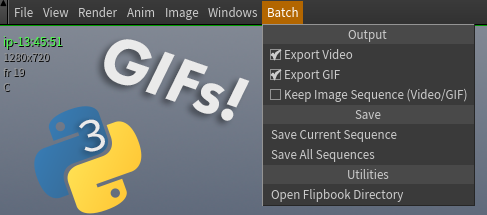
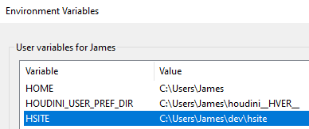

# MPlay Batch

Menu add-on for MPlay to quickly batch write sequences.





## Quick Installation ##

1. Download and extract into `mplay_batch`
2. Copy the entire `mplay_batch` folder to `$HOUDINI_USER_PREF_DIR/packages`
3. Copy `mplay_batch.json` to `$HOUDINI_USER_PREF_DIR/packages`


And you're all set!

# Overview #
- [MPlay Batch](#mplay-batch)
	- [Quick Installation](#quick-installation)
- [Overview](#overview)
- [Features](#features)
	- [Save Current Sequence](#save-current-sequence)
	- [Save All Sequences](#save-all-sequences)
	- [Export Video](#export-video)
		- [Keep Image Sequence (Video)](#keep-image-sequence-video)
	- [Open Flipbook Directory](#open-flipbook-directory)
	- [Example: Naming](#example-naming)
- [Installation](#installation)
	- [Custom Installation Location](#custom-installation-location)
	- [Installing to an `$HSITE` Demo](#installing-to-an-hsite-demo)
- [Customization](#customization)
	- [Defaults](#defaults)
	- [Custom Variables, `$JOB`, `$HIP`, etc.](#custom-variables-job-hip-etc)
		- [Example: Use a built-in Houdini Variable](#example-use-a-built-in-houdini-variable)
		- [Example: Editing the Package File](#example-editing-the-package-file)
- [Notes](#notes)
- [Future](#future)


MPlay (the built-in tool for reviewing flipbooks) comes with a really useful
feature for reviewing sequences, called the __Sequence List__. If you're not
familiar, if you click the filmstrip icon  instead of hitting <kbd>esc</kbd> or the
little red x, MPlay will start writing a new sequence to memory, while keeping
the previous one available for viewing and comparison.


<video width="960" height="540" autoplay loop>
	<source src="assets/images/sequence_list_only.mp4" type="video/mp4">
</video>

However, if you want to save the sequences out, it can be a little tedious doing
them one by one! That's where __MPlay Batch__ comes in.

Read more about the [Sequence
List here](https://www.sidefx.com/docs/houdini/mplay/mplay_sequence_dialog.html).


# Features #
## Save Current Sequence ##

Saves the currently selected sequence to a directory.


## Save All Sequences ##

Saves all loaded sequences to a directory.


## Export Video ##


<video width="960" height="540" autoplay loop>
	<source src="assets/images/export_video.mp4" type="video/mp4">
</video>

When this option is enabled, a video will be exported for each sequence you
save instead of an image sequence.

A sequence of images is always written to disk. `ffmpeg` is used to convert the
image sequence to a video, after which the image sequence is deleted.

### Keep Image Sequence (Video) ###
When **Keep Image Sequence (Video)** is toggled on, the image sequence that was
used to create the video is *not* deleted, and will remain in the same folder
alongside the video.

You can specify the video format using the `MPLAY_BATCH_VIDEO_FORMAT` key if
you'd like to use something other than the default `mp4`.

**Note** `ffmpeg` *must* be installed an available on the system's `PATH`. If
`ffmpeg` can't be found, an image sequence will still be written, but no video
will be exported, even if the option is toggled on.

## Open Flipbook Directory ##

Launches the system's file browser and navigates to the base flipbook directory (as set by `MPLAY_BATCH_FLIPBOOK_DIR`)


By default, each sequence is saved like this:

```
{FLIPBOOK_DIR}/{HIPNAME}_{SUB_VERSION}/{HIPNAME}_{SUB_VERSION}_{SEQ_INDEX}.$F.{EXT}
```


## Example: Naming ##

So if you're working in a hipfile called `myproj_sickexplosion_v002.hip`, and you ran _Save Current Sequence_ for the first time, it would be saved as:

```
$JOB/flip/myproj_sickexplosion_v002_000/myproj_sickexplosion_v002_000_0.$F.jpg
```

Each time you run _Save Current Sequence_, a new `SUB_VERSION` folder is created inside the `FLIPBOOK_DIR`. This helps keep subsequent writes unique.


When running _Save All Sequences_, all sequences loaded in memory are written to disk inside of a single `SUB_VERSION` folder. Each sequence has a unique `SEQUENCE_INDEX` suffix appended to it. In general, they _should_ write to disk in the same order they were written, however this is not guaranteed.


# Installation #

Installation is easy using [Houdini Packages](https://www.sidefx.com/docs/houdini/ref/plugins.html).

You can copy this entire folder to anywhere that packages are scanned for. Easiest is probably in your `HOUDINI_USER_PREF_DIR/packages` folder. Once you've moved it there, just copy/move the package file `mplay_batch.json` directly into `HOUDINI_USER_PREF_DIR/packages`. The package is set up by default for this configuration.

## Custom Installation Location ##

If you'd like to keep this package somewhere else, simply modify the `MPLAY_BATCH_INSTALL_DIR` key to something else, ie `"$HOME/dev/mplay_batch"` or `"C:/Users/James/houdini_tools/mplay_batch"`. Just make sure that the `mplay_batch.json` file lives in a `packages` folder that Houdini will scan.

If you're having any issues with setting up in an `$HSITE`, you can try checking out [this
post on the SideFX Forums](https://www.sidefx.com/forum/topic/77777/).

## Installing to an `$HSITE` Demo
As an example, a here is a demo of how I have set it up using my own `$HSITE` at
home:

*I do not claim that this is the only way, or even the best way. But it is **a** way.*

For more info on `$HSITE`, see [the docs](https://www.sidefx.com/docs/houdini/basics/config.html#locations).

1. `$HSITE` is set in my environment to `$HOME/dev/hsite`

   

2. Inside the `$HSITE`, there are folders for each Houdini Major.Minor version,
   as well as an **external** folder and a **packages** folder.

   

   **external** serves as a location to dump any and all 3rd party plugins.

   

   **packages** contains packages that load the plugins according to the Houdini
   version that was launched.

   


3. Inside of each `$HSITE/houdiniMajor.Minor` folder, there is a **packages**
   directory with a very simple package called `packages.json` (it can be called
   whatever you want).

   

   The package just contains:

   ```
   {
	   "package_path": "$HSITE/packages"
   }
   ```
   `package_path` is a special keyword that allows you to dynamically add other
   paths in which Houdini can scan for packages. If you prefer to set this at the system/environment level, you can also check out the `HOUDINI_PACKAGE_DIR` variable.

4. `$HSITE/packages` contains the `mplay_batch.json` package. The only
   modifcation is that the `MPLAY_BATCH_INSTALL_DIR` key is now
   `$HSITE/external/mplay_batch`.

   By default, the package uses the `houdini_version` keyword to ensure the correct version
   of the tool is loaded for whatever version of Houdini was launched.

   ```
   {
    "path": "$MPLAY_BATCH_BUILD_VERSION_DIR",
    "env": [
        {
            "MPLAY_BATCH_INSTALL_DIR": "$HSITE/external/mplay_batch"
        },
	...
	```

[Back to top](#overview)

# Customization #

There are a few parameters that can be customized via environment variables. The easiest place to set these would be in the package itself, though as long as they're set _somewhere_ (system variables, .bashrc, etc) they should be fine.

## Defaults ##

| Environment Variable          | Default     | Description                                     |
| ----------------------------- | ----------- | ----------------------------------------------- |
| `MPLAY_BATCH_FLIPBOOK_DIR`    | `$JOB/flip` | Where sequences get saved<sup>1</sup>           |
| `MPLAY_BATCH_EXTENSION`       | `jpg`       | Image type to save                              |
| `MPLAY_BATCH_PAD_SUB_VERSION` | `3`         | Zero Padding to add to the "Sub-version" suffix |
| `MPLAY_BATCH_PAD_SEQ_INDEX`   | `0`         | Zero Padding to add to each sequence's suffix   |
| `MPLAY_BATCH_VIDEO_FORMAT`    | `mp4`       | Format to use with `ffmpeg` when writing videos |

<sup>1</sup> *This directory __must__ exist. It will not be created
automatically!* `$JOB/flip` is the default naming when creating a project using
Houdini's built-in `File > New Project` dialog.

## Custom Variables, `$JOB`, `$HIP`, etc. ##

To use custom variables in the file pattern for `MPLAY_BATCH_FLIPBOOK_DIR`, just wrap it in `__` instead of starting with `$`.

### Example: Use a built-in Houdini Variable ###

Use `$HIP/flipbooks` as the default saving location:

`"__HIP__/flipbooks"`


### Example: Editing the Package File ###

Here are some examples you can add to the `env` key in the package file:

```json
{
...
	},
	{
		"MPLAY_BATCH_FLIPBOOK_DIR": "__JOB__/renders/flipbook"
	},
	{
		"MPLAY_BATCH_EXTENSION": "png"
	},
	{
		"MPLAY_BATCH_PAD_SEQ_INDEX": "2"
	},
	{
		"MPLAY_BATCH_PAD_SUB_VERSION": "4"
	},
	{
		"MPLAY_BATCH_VIDEO_FORMAT": "mov"
	}
...
}
```

[Back to top](#overview)

# Notes #

* Scripting for MPlay is a bit limited at the moment, as there is no HOM interface. Everything gets scripted with HScript, and there is no access to `hou.ui` when running MPlay. If this is ever addressed, I'll be sure to modify the code to be a bit sleeker, and have some more options!

* The `mplay_batch` package location must be appended to `PYTHONPATH` for this plugin to be picked up by MPlay. Modifying `HOUDINI_PATH` and having a `python2.7libs` directory alone is not enough (that's why it's set explicitly in the package definition).

* The entire frame range will be written for each sequence

[Back to top](#overview)

# Future #

* Could make naming more customizable
* __Save All Viewers__ option if I can figure out why only one viewer is listed when several are open!
* Verbosity, prints, logging
* See if adding a PySide dialog works

[Back to top](#overview)
